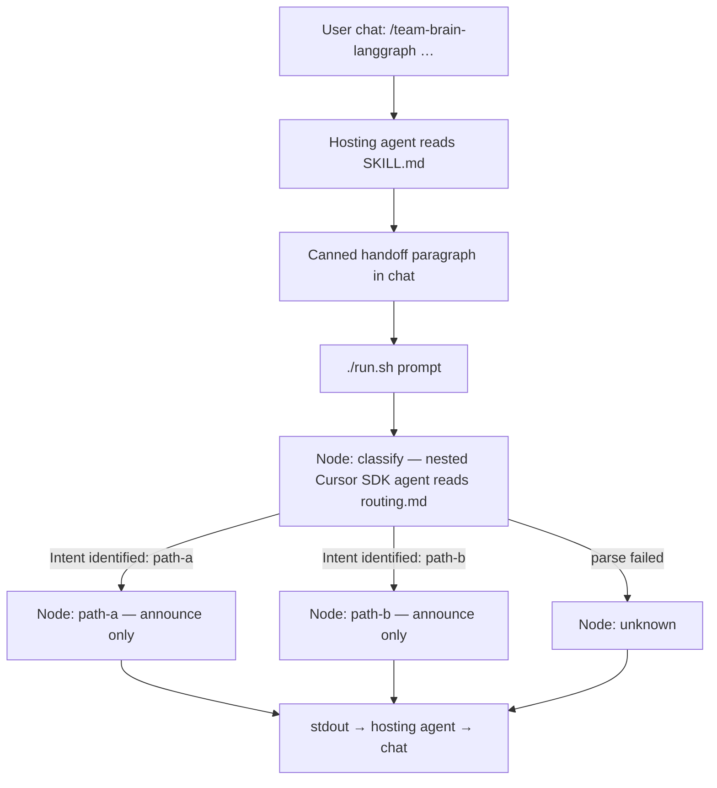

# Team Brain LangGraph

Sequel sample to [team-brain-intro](../team-brain-intro/): the user still enters through a Cursor skill in chat, but **classification is no longer done by the hosting agent**. The skill is a launcher. It prints a canned handoff, then runs a Python [LangGraph](https://github.com/langchain-ai/langgraph) process. The first graph node starts a **nested Cursor agent** (Python SDK) that reads `routing.md` and announces `path-a` or `path-b`. A trivial leaf node then announces itself. That stdout is what the hosting agent pastes back into chat.

Companion to [Building Scalable Skills for Agentic Workflows](https://codesloth.blog/building-scalable-skills-for-agentic-workflows/). This folder is the living sample; a later post can be written from this README.

Open **this folder** as a Cursor project so the skill at `.cursor/skills/team-brain-langgraph/` is available.

## What you invoke

You never run LangGraph yourself for the demo. In chat:

```
/team-brain-langgraph Say hello from the left-hand path
/team-brain-langgraph Farewell from path b
```

The hosting agent:

1. Prints the canned handoff paragraph (it does **not** classify).
2. Runs `./run.sh <your prompt>` via the Shell tool.
3. Relays graph stdout into the chat reply.

## Graph



Dummy intents (see [routing.md](.cursor/skills/team-brain-langgraph/routing.md)):

| Intent id | Rough triggers | Leaf |
|-----------|----------------|------|
| `path-a` | hello, greet, left, first, alpha, path a | `=== NODE: path-a ===` plus a canned sentence |
| `path-b` | goodbye, farewell, right, second, bravo, path b | `=== NODE: path-b ===` plus a canned sentence |

`SKILL.md` does **not** contain that table. If it did, the hosting agent would see it on invoke and might classify before the graph ran. The nested agent is told to read `routing.md`. The hosting agent is told not to.

## Why the Python SDK (not the Cursor CLI)

The **entry point** is still the IDE agent (`/team-brain-langgraph`). The nested classify call is a Cursor agent started from Python.

| | Cursor CLI (`agent -p`) | Python SDK (`cursor-sdk`) |
|--|-------------------------|---------------------------|
| Meant for | Humans and shell scripts | Apps, CI, graph nodes |
| Auth | `agent login` (keychain) or `CURSOR_API_KEY` | `CURSOR_API_KEY` (or explicit `api_key`) |
| Isolation | Loads project skills/rules from cwd unless you fight it | Omit `setting_sources`; allowlist `tools=["read"]` |
| Result | Text / JSON on stdout | `RunResult`, streams, cancel, dispose |
| Recursion | Nested CLI in this folder can re-hit the same skill | Read-only tools + no setting sources + prompt guard |

SDK is the better fit for “a LangGraph node that calls Cursor”. The IDE chat session token is **not** passed into child processes either way. This sample needs `CURSOR_API_KEY` in the environment the hosting agent's Shell tool inherits (shell profile, or Cursor env). Mint a user key at [Cursor Dashboard → API Keys](https://cursor.com/dashboard/api).

The nested agent uses this sample folder as `cwd` so it can `read` `routing.md`. It does **not** load project/user skills (`setting_sources` left unset). Tools are allowlisted to `read` so it cannot Shell back into `./run.sh`.

## Setup (once)

```bash
cd team-brain-langgraph
cp .env.example .env               # then paste your key
chmod +x run.sh                    # if git dropped the bit
```

`./run.sh` sources `.env` if present, then creates `.venv` and installs [requirements.txt](requirements.txt) on first run. You can also `export CURSOR_API_KEY` in the environment the hosting agent's Shell tool inherits. You do not need to run `./run.sh` yourself before invoking the skill.

Optional: `CURSOR_MODEL` (default `composer-2.5`).

## Layout

| Path | Purpose |
|------|---------|
| [.cursor/skills/team-brain-langgraph/SKILL.md](.cursor/skills/team-brain-langgraph/SKILL.md) | Launcher only: canned paragraph, run graph, relay stdout |
| [.cursor/skills/team-brain-langgraph/routing.md](.cursor/skills/team-brain-langgraph/routing.md) | Dummy `path-a` / `path-b` table. Nested agent reads this. Hosting agent must not. |
| [graph.py](graph.py) | LangGraph: classify → path-a \| path-b \| unknown |
| [run.sh](run.sh) | venv + `python -u graph.py --prompt …` |
| [.env.example](.env.example) | Documents `CURSOR_API_KEY` (do not commit a real key) |

## Expected chat shape

1. Hosting agent (from the skill), **before** the graph:

   ```text
   Handing this prompt to the Team Brain LangGraph router.

   This skill does not classify intent. Classification runs inside the graph.
   A nested Cursor agent will read routing.md, announce the path, and a leaf node will announce itself.
   ```

2. Graph stdout (relayed verbatim), classify then leaf:

   ```text
   === NODE: classify (nested Cursor agent) ===

   Intent identified: path-a

   <one short sentence from the nested agent>

   === NODE: path-a ===

   LangGraph routed here because the classify node announced path-a. …
   ```

## Recursion guard

The nested agent runs in this project. Without guards it could invoke `/team-brain-langgraph` and start another graph. This sample:

1. Sets `disable-model-invocation: true` on the skill (opt-in by name only).
2. Leaves SDK `setting_sources` unset so project skills are not injected.
3. Allowlists `tools=["read"]` (no Shell, no Task, no edits).
4. Prompts the nested agent: classify only; do not invoke skills; do not start Python.

## How this extends the intro post

| Intro (`team-brain-intro`) | This sample |
|----------------------------|-------------|
| `SKILL.md` classifies | `SKILL.md` launches |
| Hosting agent announces `Intent identified:` | Nested SDK agent announces it inside the graph |
| Workflows do real (demo) work | Leaves only announce which node ran |
| Progressive disclosure of markdown workflows | Progressive disclosure still applies: hosting agent never opens `routing.md` |

Keep this folder as its own starter, same as other samples in this repo. Do not grow `team-brain-intro` into a maze.
